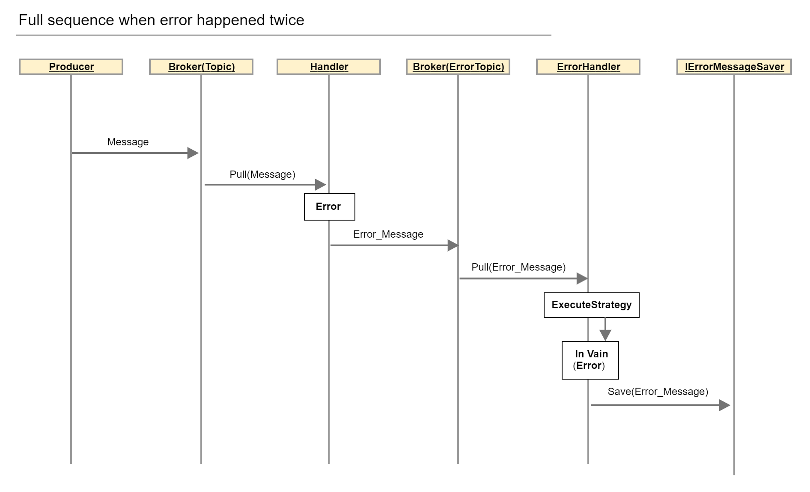

# Niazza.KafkaMessaging

## Cases of handling

For more information please see *examples*

### Connection of the Producer

**Startup.cs**
```
public void ConfigureServices(IServiceCollection services)
{
    services.AddKafkaProducers(new ProducerConfiguration
    {
        //brokers comma-separated
        Servers = "localhost:9092",

        //default ToAllBrokers. ACKs message when all brokers aproved
        AckType = AckToBrokersType.ToAllBrokers,

        /// makes all messages idempotent
        /// overrides AckType configurations
        /// Ack sets toAll automatically if Idempotence is set
        Idempotency = MessageIdempotency.UseIdempotent
    });
}
```

### Message publishing
```
class TestProducer
{
    private readonly IAsyncProducer _asyncProducer;

    private readonly IProducer _asyncProducer;

    public SafeProducer(IAsyncProducer asyncProducer, IProducer producer)
    {
        _asyncProducer = asyncProducer;
        _producer = producer;
    }
    
    //for async
    public Task ProduceAsync<TMessage>(TMessage message, string topic) where TMessage: class
    {
        return _asyncProducer.ProduceAsync(message, CancellationToken.None, topic);
    }

    //for sync
    public void Produce<TMessage>(TMessage message, string topic) where TMessage: class
    {
        return _producer.BeginProduce(message, topic);
    }
}

```

### Consumer registration
```
 public class Startup
    {
        public void ConfigureServices(IServiceCollection services)
        {
            services.AddKafkaConsumers(configuration =>
                {
                    //brokers
                    configuration.Servers = "localhost:9092";
                    // consumer group
                    configuration.GroupId = "test-group";
                    // False  - Do NOT commit on ErrorHandling when error or exception appears and ROLLBACKs the caret on the partition. Does not use handler Error Strategies
                    // True - Depends on *Behavior* property if *Auto* - then autocomits if *Hybrid* - it commits after all handlers will be executed
                    configuration.IsAutocommitErrorHandling = true;
                    // Choices: AutoCommit, Hybrid
                    configuration.Behavior = MainConsumerBehavior.AutoCommit;
                    // Handling interval. Dafault is 0
                    configuration.AsyncHandlingIntervalMs = 100;
                }, new IHandlerContainer[]
                {
                    new HandlerContainer<TestHandler, Notify>(new Dictionary<ExecutionResult, ErrorHandlingConfiguration>()
                    {
                        //sets strategy
                        {ExecutionResult.Failed, ErrorHandlingConfiguration.GetScheduled()}
                    }), 

                    //Adding customized Serializer RAW 
                    new HandlerContainer<RawTestHandler, string>(
                        new CustomizedHandlerSettings(
                            new Dictionary<ExecutionResult, ErrorHandlingConfiguration> {{ExecutionResult.Failed, ErrorHandlingConfiguration.GetScheduled()}},
                            behavior:MainConsumerBehavior.AutoCommit, 
                            topic: "raw-topic",
                            serialization: new RawMessageSerialization())),

                    new HandlerContainer<XmlTestHandler, NotifyXmlMessage>(
                        new CustomizedHandlerSettings(
                            new Dictionary<ExecutionResult, ErrorHandlingConfiguration> {{ExecutionResult.Failed, ErrorHandlingConfiguration.GetScheduled()}},
                            behavior:MainConsumerBehavior.AutoCommit,
                            //Adding customized Serializer XML 
                            serialization: new XmlMessageSerialization())),
                });


            //Gathering Statistics
            services.AddKafkaStatisticPolling(new AnyPollingService());

            //Saving error if strategies finished. Default is <InFileErrorSaver>
            services.AddKafkaErrorRecovering(new AnyErrorSaver())

        }

        public void Configure(IApplicationBuilder app, IServiceProvider provider, IApplicationLifetime lifetime)
        {
            var starter = provider.GetService<IConsumerStarter>();
            lifetime.ApplicationStarted.Register(() => starter.RunAsync(_tokenSource.Token));
            lifetime.ApplicationStopping.Register(() => _tokenSource.Cancel());
        }

    }
```

## How does it works

### Sequence diagram of full Niazza.KafkaMessaging flow



### Logical schema of Niazza.KafkaMessaging


### Types of errorStrategy

- `NoneStrategy` : claims no action if an error happen
- `RepeatOnceStrategy` : tries to handle once, if in vain - sends to safe handler
- `RepeatScheduledStrategy` : you can schedule intervals if retries (by defalut is Fibonacci grown multiplicity for three days)
- `RepeatTillSuccessStrategy` : 1000 attempts of tries with equal interval (5 seconds by default)

Error topic is build of two parts `errors-` + `<name of consumer group>`. The prefix can be mofified.

### Behaviors of handling

- `MainConsumerBehavior.AutoCommit` : Commits when message is received. Error handling depends on IsAutocommitErrorHandling
- `MainConsumerBehavior.Hybrid`  : Commits when all selected handlers was executed. Errors will be handled using strategies. If the Hybrid was selected and IsAutocommitErrorHandling == true then error strategies will be ignored - the rollback will be used
- `MainConsumerBehavior.Manual` : Commits when Message was handled correctly. Error strategies is FULLY ignored.  Warn, a huge message lags could happen until exception won't be catch or disappeared